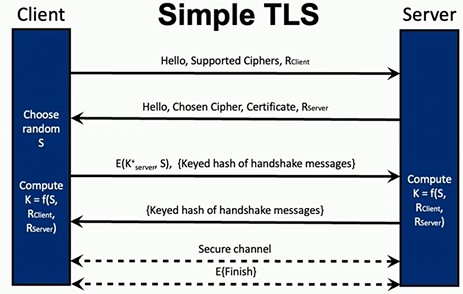
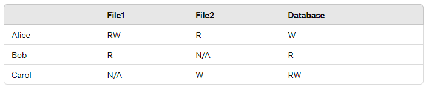

# Future Learning Objectives

> **Additional study material:** This document was supplied from an external source. It is not instructor-provided course material and is not confirmed to be part of CSC 574 assessments.

> **Source:** User-provided `CSC_574_Final_Exam_Study_Guide_Formatted.docx`.

## **1.1 Security Fundamentals**

> File name - S24-csc574-slides-02-security-fundamentals
>
> Lecture number - 02
>
> **Objectives:**

**• Define:** confidentiality, integrity, availability, asset, participant, vulnerability, threat, adversary, defense, authorization, authentication, TCB, risk

**• LDI:** types of attacker (casual user, cyber criminal, nation state, …)

**• LDI:** the 4 archetype attacks and the 5 archetype defenses

**• Differentiate:** concepts of trusted and trustworthy

**• Create and articulate:** threat models for well-understood systems

**• Define:** the principle of adequate protection

## **1.3 Secret Key Crypto**

> File name - lec03-symmetric
>
> Lecture number - 03
>
> **Objectives:**

**• Define:** cryptology, cryptography, cryptanalysis, plaintext, ciphertext, encryption, decryption, key, keyspace, perfect secrecy

**• Define:** Kirckhoffs’s principle and why cryptosystems should conform to it

• Identify key management problems

• Explain types of cryptanalysis

• Explain OTP, how it offers perfect secrecy, and list issues that complicate its use

**• NOT:** Understand symmetric cipher internals

• Define stream cipher, block cipher, block size, permutation, substitution, confusion, diffusion

• Explain the distinction between stream and block ciphers

• List and explain potential problems with using stream ciphers

• Explain, diagram, and identify pros and cons of ECB, CBC, and CTR cipher modes

• Choose an application-appropriate symmetric cipher and mode.

• Identify which cipher modes guarantee integrity

## **1.4 Hashes and Message Authentication**

> File name - lec04-hashes
>
> Lecture number - 04
>
> **Objectives:**

• Create cryptographic constructions that provide integrity and authenticity

• Explain the security differences between EtM, E&M, and MtE

• Identify and explain the three properties of a cryptographic hash function

• Explain the significance of the birthday paradox to hash function security

• Explain how HMAC works and why it is needed

• Describe how authenticated encryption modes of operation are different from EtM, E&M, and MtE.

• Identify at least three applications of hash functions

## **1.5 Asymmetric Cryptography**

> File name - lec05-asymmetric
>
> Lecture number - 05
>
> **Objectives:**

• Explain common uses of RSA

• Explain the components of RSA public and private keys and their relationship (including the common modulus and its significance to public/private keys)

• Calculate (for small numbers) an RSA public/private keypair and encrypt/decrypt a message using RSA

• Identify and explain the hard problem underlying RSA

• Explain why “textbook” RSA is insecure (e.g., probable message attacks, timing attacks) and the intuition behind avoiding those problems (e.g., padding, blinding).

• Explain why asymmetric crypto operations are rarely performed directly on data, and what we do instead.

• Explain digital signatures, common uses, and compute a digital signature given a small RSA public/private key pair

• Explain the differences between a digital signature and an HMAC and the concept of non-repudiation

## **1.6 Key Management**

> File name - lec06-keymanagement
>
> Lecture number - 06
>
> **Objectives:**

• Explain the uses of Diffie-Hellman

• Complete both steps of a DH exchange, given a small modulus and base

• Identify and explain the hard problem underlying DH

• Explain practical attacks on DH (e.g., middle-person, logjam) and solutions (e.g., authenticated DH)

• Define and explain perfect forward secrecy

• Explain how the CA model solves the “turtles problem”

• Explain the purpose of a certificate, and the processes of obtaining, verifying, and revoking a certificate w.r.t. a CA

• Explain Public Key Infrastructures and potential problems with their use, including examples (e.g., DigiNotar incident), and potential solutions (e.g., certificate transparency, CA pinning)

• Explain the tradeoffs between “web of trust” and PKI models

## **1.7 User Authentication**

> File name - lec07-userauth
>
> Lecture number - 07
>
> **Objectives:**

• Define authentication, credential

• Explain the difference between authentication and identification

• Explain why authentication is fundamental to security

• Identify examples of biometric authenticators and explain issues with their use

• Identify examples of bearer-authenticators (“something you have”)

• Identify and explain common problems, attacks and defenses related to passwords and secret questions, including online and offline brute-force attacks

• Explain how salts and password stretching work, as well as how they mitigate brute-force attacks (and in what situations they help)

• Explain the implications of password reuse (e.g., credential stuffing) and how password managers help

• Identify three types of credentials, trade offs, and give examples

• Define and explain multi-factor authentication

• Explain the trade-offs of SMS as a second factor

## **1.8 Authentication Protocols**

> File name - lec08-authproto
>
> Lecture number - 08
>
> **Objectives:**

• Explain web authentication protocols and security issues with their use

• Explain cryptographic authentication protocols

• Design and critique cryptographic authentication protocols

◦ Design cookie authenticators, challenge–response protocols, and protocols that establish and/or distribute session keys

◦ Explain why a protocol authenticates a party

◦ Explain the purpose of nonce in authentication protocols

◦ Identify flaws in a protocol (e.g., reflection, replay attacks)

• Explain how tickets can provide single sign-on (SSO)

• Explain the functionality of the KDC and TGS in Kerberos

## **Cryptography**

◦ define

▪ cryptosystem

▪ method of disguising plaintext messages so that only select parties can decipher the ciphertext

▪ cryptology

▪ the combined study of cryptography and cryptanalysis

▪ cryptography

▪ the art/science of developing and using cryptosystems

▪ cryptanalysis

▪ the art/science of breaking cryptosystems

▪ plaintext

▪ This is the original, readable message or data that is fed into an encryption algorithm. It's the unencrypted information that is understandable without any need for decryption.

▪ ciphertext

▪ This is the result of encrypting plaintext. Ciphertext is transformed from readable data into an unreadable format through the encryption process. It is designed to hide the plaintext's content from anyone who does not have the proper decryption key.

▪ encryption

▪ The process of converting plaintext into ciphertext. Encryption uses an algorithm and a key to transform the readable data (plaintext) into an unreadable format (ciphertext) to protect the data's confidentiality.

▪ decryption

▪ The reverse process of encryption, decryption converts ciphertext back into plaintext. This process uses a decryption key, which may or may not be the same as the encryption key, depending on the encryption method used (symmetric or asymmetric encryption).

▪ key

▪ an input to a cryptographic algorithm used to maintain security int he presence of an adversary

▪ keyspace

▪ a set of possible keys in a cryptosystem

▪ perfect secrecy

▪ A property of an encryption system where the ciphertext does not reveal any information about the plaintext, except possibly its length.

▪ cant bruteforce it because you’ll always get any answer possible

▪ cipher

▪ any algo that’s used for encryption and decryption

▪ stream cipher

▪ an algo that generates a long keystream from a short key

▪ acts as a random number generator with the key as the seed

▪ works just like OTP. XOR with plaintext to encrypt, XOR w ciphertext to decrypt

▪ block cipher

▪ function that replaces a fixed length input with a fixed length output

▪ input/output size is called the “block size”

▪ block size

▪ input/output size of block cipher

▪ permutation

▪ deterministically scrambling things around

▪ substitution

▪ have mapping of one char to another char

▪ confusion

▪ we want to hide relationship between ciphertext and the key. cant learn anything ab key from ciphertext

▪ diffusion

▪ hiding relationships between plaintext and ciphertext.

◦ define kirckhoff’s principle and why cryptosystems should conform to it

▪ cipher method should not be required to be secret. must be able to fall into hands of enemy without inconvenience

▪ “the enemy knows the system”

◦ identify key management problems

▪ key management (how to prevent keys from being leaked or from being stolen)

▪ who gets which keys and how to securely get the keys?

◦ explain types of cryptanalysis

**▪ ciphertext-only attack:** eve has access only to ciphertext

**▪ known-plaintext attack:** eve has access to plaintext and corresponding ciphertext

**▪ chosen-plaintext attack:** eve can choose plaintext and learn ciphertext

**▪ chosen-ciphertext attack:** eve can choose ciphertext and learn plaintext

◦ explain OTP, how it offers perfect secrecy, and list issues that complicate its use

▪ one-time pad

▪ plaintext XOR random-pad = ciphertext

▪ ciphertext XOR random-pad = plaintext

▪ random-pad generated on encryption then sent to receiver who uses it to decrypt. then gets rid of it

▪ offers perfect secrecy because we can prove that knowledge of ciphertext yields no info about what plaintext might be

▪ XOR anything with randomness, you get randomness out.

▪ there is always a key that maps any message to any ciphertext

▪ issues

▪ key must be as long as the message. can be extremely big and impractical during key-management

▪ if key is used twice, plaintexts can be cracked. can never reuse otp

▪ no integrity protection

◦ explain the distinction between stream and block ciphers

▪ stream ciphers encrypt data one bit or byte at a time (like stream of water flowing). block ciphers encrypt data in fixed-size blocks at a time. stream

> ciphers often used in real-time communication systems while block ciphers usually used to encrypt data that is stored rather than sent.

◦ list and explain potential problems with using stream ciphers

▪ does not offer perfect secrecy

▪ still has problem of not allowing key reuse

◦ explain, diagram, and identify pros and cons of ECB, CBC, and CTR cipher modes

**▪ Electronic Code Book:** break message into blocks, encrypt each block, send message in pieces. Same on decrypt side

**▪ issues:** it leaks information. dont use ecb to gen large amts of ciphertext

**▪ Cipher Block Chaining:** adds in a random IV to randomize ciphertext appearance

▪ IV isn’t secret!

▪ chains together by XOR-ing the prev ciphtxt with current plntxt block

**▪ issues:** need things sent in order. need to reassemble before decrypting. cannot encrypt blocks in parallel

**▪ Counter Mode:** a pseudorandom function

▪ given an input but no key, hard to predict any part of output

▪ use to gen keystream by encrypting a counter the size of the block

▪ turns block cipher into stream cipher

▪ prevent keystream reuse, we can start counter at random value

**▪ issues:** limitation on integrity, adversary knowns flipping a bit in ciphtxt can change same bit in plntxt. also have to worry ab key stream reuse

◦ choose an application-appropriate symmetric cipher and mode

◦ identify which cipher modes guarantee integrity

_NOT: understand symmetric cipher internals_

## **Symmetric crypto and hashes**

◦ Create cryptographic constructions that provide integrity and authenticity

▪ integrity = ensuring data cannot be changed in unauth way

▪ authenticity = ensuring that a message originated from a particular source

▪ message authentication codes (MACs) provide message integrity and authenticity

▪ MAC uses symmetric encryption

▪ Uses encryption for confidentiality, MAC for integrity, key for authenticity

◦ Explain the security differences between EtM, E&M, and MtE

**▪ E&M:** encrypt plaintext message, mac plaintext message, send output of both together. in general, not secure bc does not provide confidentiality + could leak information

**▪ MtE:** take message, compute mac first, then encrypt both together

▪ encryption does not provide integrity

▪ leads to padding attack

**▪ EtM:** take msg, encrypt it, then compute mac over ciphertxt, not plntxt.

▪ best way to do it, easiest to prove secure

▪ ETM - ensures both integrity and authenticity of ciphtxt itself. attacker cannot modify encrypted data without also changing mac

▪ E&M - less secure bc attacker can potentially manipulate plntxt affecting integrity of encrypted message

▪ MtE - can hide MAC errors and make padding oracle attacks possible

◦ Identify and explain the three properties of a cryptographic hash function

▪ one-way property

▪ cannot find x’ from h(x’)

▪ weak collision resistance

▪ no other y should be able to also be hashed to = hash of another x

▪ Given a message and its hash, it should be very hard to find another message that has the same hash

▪ strong collision resistance

▪ It should be very hard to find any two different messages that result in the same hash.

◦ Explain the significance of the birthday paradox to hash function security

▪ the probability of two or more people in a group of 23 share the same birthday is greater than 50%

▪ relates to hash function security because of the likelihood of two different inputs producing the same hash output (a collision)

▪ birthday attack exploits this to find collisions in hash functions more efficiently than brute force

**▪ implication:** collisions can be found in approximately square root of hash output size

◦ Explain how HMAC works and why it is needed

▪ H(k XOR outerpad \|\| H(k XOR innerpad\|\| M))

▪ ipad and opad used to make it provably secure

**◦ extra:** cbc-mac: last block of cbc-encrypted cipher text depends on both secret key and every block of plaintext. great if you need integrity but not confidentiality

▪ if use cbc to encrypt, you must use diff key to compute MAC

◦ Describe how authenticated encryptions modes of operation are different from EtM, E&M, and MtE.

▪ CCM (counter with CBC-MAC) - counter mode for encryption, cbc-mac for mac (use diff keys)

▪ GCM (Galois/Counter mode) - doing multiplication over galois field, chain together similar to cbc (tends to be more efficient than ccm)

◦ Identify at least three applications of hash functions

## **Asymmetric cryptography**

◦ Explain common uses of RSA

◦ Explain the components of RSA public and private keys and their relationship (including the common modulus and its significance to public/private keys)

▪ e = exponent

▪ d = exponent

▪ n = modulus

▪ n = p \* q

▪ public key = e and n

▪ private key = d and n

▪ d and e need to be multiplicative inverses of each other (multiply together = 1)

▪ two prime numbers p and q (need to be BIG like 1024 bits big)

◦ Calculate (for small numbers) an RSA public/private keypair and encrypt/decrypt a message using RSA

◦ Identify and explain the hard problem underlying RSA

◦ Explain why “textbook” RSA is insecure (e.g., probable message attacks, timing attacks) and the intuition behind avoiding those problems (e.g., padding, blinding).

▪ its entirely deterministic in the plain text. if you use same key to encrypt same plaintext twice, you get same answer. anyone can compute rsa encryption with your public key.

▪ if they want to see if you sent a message, they can encrypt the message and confirm if what they saw is a ciphertext.

▪ random padding so message includes randomness that other side knows to throw it away but every encryption there is different outcome.

▪ textbook RSA lacks integrity!

▪ timing attacks are very effective against RSA. uses blinding to prevent against these attacks (pick random number encrypt it, and multiply by it)

◦ Explain why asymmetric crypto operations are rarely performed directly on data, and what we do instead.

▪ extremely time intensive and inefficient for large amounts of data. There are limits due to key size which can restrict the message size to be sent and this would be extremely poor to use asymmetric crypto operations with. Instead, we can encrypt the data a separate way using a symmetric key. we then use asymmetric crypto operations to encrypt and send that key to the recipient along with the encrypted message. from there, the recipient would then decrypt the key and then use the key to decrypt the message. this is a hybrid encryption.

◦ Explain the differences between a digital signature and an HMAC and the concept of non-repudiation

▪ properties of digsig

**▪ no forgery possible:** no one can forge message from alice

**▪ authenticity check:** you should be able to verify if signed message is really from alice

**▪ no alteration/integrity:** no party can undetectably alter a signed message

▪ provides authentication, integrity, and non-repudiation (cannot deny having signed a signed msg)

## **Key management**

◦ key dist vs key agree

▪ key distribution is process where a key is assigned to someone

▪ key agreement is where two or more parties cooperate on which key to use

◦ Explain the uses of Diffie-Hellman

▪ allows for negotiating a secret over insecure channels

▪ participants exchange intractable puzzles that can be solved easily without additional info

▪ alice and bob share a puzzle with each other and its impossible to solve unless you know a trick. alice and bob are the only ones who know the trick.

◦ Given a small modulus and base, complete both steps of a DH exchange

◦ Identify and explain the hard problem underlying DH

▪ subject to attacks by an ACTIVE adversary (Mallory)

▪ weak to on-path attacks (man in the middle attack). this is key agreement, not authentication

▪ leads to authenticated DH

▪ use digital signatures?

◦ Explain practical attacks on DH (e.g., middle-person, logjam) and solutions (e.g., authenticated DH)

◦ Define and explain perfect forward secrecy

▪ why use authenticated DH vs. Alice choosing a secret k, signing it, and encrypting it with bob’s public key?

**▪ answer:** it provides perfect forward secrecy

▪ K is valid just for the session (ephemeral)

▪ K cannot be computed later if adversary obtains better tech (quantum computer)

◦ Explain how the CA model solves the “turtles problem”

▪ one person, set of people, or entities that we give our trust to. sometimes gov agency, sometimes enterprise.

▪ will often have multiple trust anchors where if any one of them vouches for something, we will trust it.

▪ often have several layers of delegation (Y vouches for X, Z vouches for Y, I trust Z therefore I trust X)

▪ The certificate includes identity, public key, plus signature from a trusted party. they are signed by a certificate authority (CA)

▪ people trust a CA to vet identity

▪ identity may have been vetted by a registration authority

◦ Explain the key purpose of a certificate, and the processes of obtaining, verifying, and revoking a certificate w.r.t. a CA

▪ solves a lot of redundancy problems.

▪ root certificate

▪ send signature (created from private key) and public key to CA. they will use public key to verify your identity

**▪ revocation causes:** lost priv key, compromised, owner no longer authorized

◦ Explain Public Key Infrastructures and potential problems with their use, including examples (e.g., DigiNotar incident), and potential solutions (e.g., certificate transparency, CA pinning)

▪ PKI is hierarchy of keys used to authenticate certificates

▪ requires root of trust (aka trust anchor)

▪ have to work your way up the tree to ensure that the CA has the authority to issue a certificate (ncsu.edu CA cannot issue a cert for chase.com)

**▪ cert transparency:** a CA will publicly publish every certificate they issue.

◦ Explain the tradeoffs between “web of trust” and PKI models

## **User authentication**

◦ Define

▪ authentication - “who are you?”

▪ the evaluation of credentials

▪ credential - the proof of identity

◦ Explain the difference between authentication and identification

▪ authentication

▪ evaluates authenticity of identity proving credentials

▪ identification

▪ actual process of determining the identity (applying for driver license, they are doing identification process)

▪ ascertains the identity of another person

▪ identification is like the process of claiming an identity while authentication is the process of proving your claimed identity is valid

◦ Explain why authentication is fundamental to security

◦ Identify examples of biometric authenticators and explain issues with their use

▪ fingerprint

▪ imperfect contact

▪ finger damage/finger loss

▪ lost fingerprints

▪ face recognition

▪ “fuzzy credential” (face changed based on mood)

▪ retina scanners

▪ voice signature

▪ easily spoofed

▪ dna

▪ hard for use online

▪ biometrics are not good against a strong adversary

▪ revocation (if your biometrics are leaked) what do you do?

▪ there must always be a tolerance level (no fingerprint is EXACTLY the same every time you scan it)

▪ static vs dynamic

▪ static - measuring state of your body at a certain point in time

▪ dynamic - continuous authentication. looks at dynamic features like how you move or act

◦ Identify examples of bearer-authenticators (“something you have”)

▪ tokens (transponders)

**▪ how it works:** one time password

▪ ezpass

▪ SecureID

▪ YubiKeys

▪ smartphones

▪ smartcards (store cryptographic keys onto a credit card sized card)

▪ SIM card in phone is common example

▪ unpowered processors

▪ small nv storage

▪ tamper resistant

▪ digital certificates (used by websites to authenticate themselves to customers)

◦ Identify and explain common problems, attacks and defenses related to passwords and secret questions, including online and offline brute-force attacks

◦ Explain how salts and password stretching work, as well as how they mitigate brute-force attacks (and in what situations they help)

▪ instead of storing H(salt\|password), store H^N(salt\|password) for some large number N

◦ Explain the implications of password reuse (e.g., credential stuffing) and how password managers help

▪ cred stuffing (when password for one site is cracked, adversaries will try that password on every other online site)

◦ Identify three types of credentials, tradeoffs, and give examples

▪ something you know

▪ password, passphrase, security questions, SSN

▪ something you have

▪ authentication app, key fob with code, MFA

▪ something you are

▪ biometrics (fingerprints, iris scans, voice prints)

◦ Define and explain multi-factor authentication

▪ requiring more than one authentication method

▪ usually it’s jsut 2-factor auth (2FA)

▪ often you want all three types of credentials (something you have, know, are)

◦ Explain the trade-offs of SMS as a second factor

▪ apps have API access and can intercept SMS messages

▪ not encrypted in transit so if intercepted, anyone can read it

▪ SIM card cloning

▪ social engineering cellular provider

## **Authentication protocols**

◦ Explain web authentication protocols and security issues with their use

▪ sometimes designed to authenticate both parties (mutual authentication)

▪ sometimes just client auth or server auth

**▪ issues:** weak keys/weak passwords, reflection attack

◦ Explain cryptographic authentication protocols

◦ Design and critique cryptographic authentication protocols

▪ Design cookie authenticators, challenge–response protocols, and protocols that establish and/or distribute session keys

▪ Explain why a protocol authenticates a party

▪ Explain the purpose of nonce in authentication protocols

▪ Identify flaws in a protocol (e.g., reflection, replay attacks)

◦ Explain how tickets can provide single sign-on (SSO)

◦ Explain the functionality of the KDC and TGS in Kerberos

## **1.9 Transport Layer Security**

> File name - lec09-tls
>
> Lecture number - 09
>
> **Objectives:**

• Explain the “simplified” SSL protocol presented in class

**◦ Connection Initiation:** The client initiates the connection.

**◦ Security Parameters:** The server selects security parameters.

**◦ Keying Material:** The client generates keying material.

**◦ Server Authentication:** The server authenticates and replicates the client's keying material.

**◦ Communication:** Client and server then communicate securely

• Identify, explain, and compare key exchange methods

**◦ RSA:** server must have certificate, client encrypts secret with server’s public key

◦ Fixed DH: server and client exchange public keys, certified by their certificates. You have a sort of certificate (instead of putting encryption key in the cert, you put a DH share)

**◦ Ephemeral DH (EDH):** temp public keys are exchanges and authenticated via an RSA signature. Uses a certificate and a DH share to provide PFS

**◦ Anonymous DH:** Exchanges keys without authentication, making it vulnerable to MITM attacks

• Explain the differences between server and mutual authentication

◦ Server authentication involves the 5 steps mentioned above whereas mutual authentication has the client also authenticating themselves. Once the server sends certificate to client, the server then requests a certificate from the client. The client then sends the server its own certificate and then signs the keyedhas of the message and sends it to the server.

• Identify attacks that circumvent SSL and/or TLS

**◦ Cipher downgrade attack:** forces use of weaker encryption by manipulating handshake messages

**◦ Truncation attacks:** attacker signals the end of a session prematurely, leading to potential data exposure

**◦ Certificate verification issues:** improper validation of ssl certificates by applications can lead to MITM attacks

**◦ BEAST, CRIME, and POODLE attacks:** exploint vulnerabilities in cipher block chaining in SSL 3.0 and compression methods

> Cant do TLS 1.3 without PFS

## **1.10 TCP Attacks and Firewalls**

> File name - lec10-tcp-fw
>
> Lecture number - 10
>
> **Objectives:**

• Explain and describe IP message spoofing, sequence number guessing, port scanning, and ARP spoofing

◦ IP Message Spoofing: This involves forging the source address in IP packets to make the traffic appear as if it is coming from a trusted, legitimate source. This can be used to deceive systems or individuals and gain unauthorized access to network resources.

◦ Sequence Number Guessing: In TCP communications, sequence numbers are critical for maintaining the order of packets. An attacker might guess the sequence number to inject malicious packets into a session, potentially hijacking or disrupting the communication.

◦ Port Scanning: Method to determine what hosts are on a network and what services they run (usually by port but also sometimes software versions). Often first step of attacker recon and defender penetration testing. Most common tool is nmap.

▪ Types of port scanning

• Python script that iterates over IP address and then another script that iterates over ports. If it works, it opens, if not, it doesnt. (TCP Scanning)

• SYN scanning. You send a syn and thats it. If something comes back, the you know its open. Often called half-open scanning as it does not open the full TCP connection. It is “noisy”.

◦ ARP Spoofing: ARP resolves IP addresses to MAC addresses. ARP spoofing involves sending fake ARP messages onto a network, associating the attacker’s MAC address with the IP address of another host, such as the gateway. This results in the sending of data to the attacker instead of the intended target.

• Define and compare stateless and stateful firewalls

• Evaluate a firewall policy for a given packet

> Job of TCP is to create an identity for particular services/connections and ensure reliable delivery. Every message is acknowledge at some point and if not, it will
>
> retransmit. Also flow control. You can transmit/create data faster than your receiver can process it.
>
> Key property of TCP is congestion control.
>
> Firewall is a device that sits between two or more network entities (like routers) that monitors traffic. They are intended to implement a policy to determine what traffic is acceptable or not.

## **1.11 VPN**

> File name - lec11-vpns
>
> Lecture number - 11
>
> **Objectives:**

• Identify and explain two main types of VPNs

◦ Institutional VPN

▪ Primarily used by organizations like enterprises and universities to provide secure access to their networks over the public internet

▪ Connect different segments of an organization’s network across geographically separated areas, amking it appear as a single unified network

▪ Focuses more on security and network management

◦ Commercial VPNs

▪ Offered by third-party providers that are most used by individuals to maintain privacy and security while browsing the internet.

▪ They route the user’s internet traffic through provider’s servers which masks the user’s IP address and encrypts their data.

▪ Often used to bypass geo-restrictions and maintain anonymity online.

• Describe the advantages and disadvantages of a split VPN

◦ What is a split VPN

▪ A VPN configuration that routes only part of the user’s traffic through the VPN tunnel (usually only traffic that needs access to protected network resources) while the rest o the traffic accesses the internet directly

◦ Advantages

▪ Improved performance by reducing load on the VPN gateway

▪ Less bandwidth consumption on the VPN tunnel

◦ Disadvantages

▪ Traffic not routed through the VPN might be exposed to eavesdropping or attacks, potentially compromising user’s data.

▪ Users might have false sense of security for all their internet activities, not just those routed through VPN

## **1.12 Intrusion Detection Systems**

> File name - lec12-ids
>
> Lecture number - 12
>
> **Objectives:**

• Define and compare signature vs. anomaly IDS

◦ IDS

▪ A device or software application that monitors a network or system for malicious activity. Any detected activity or violation is typically reported to an admin.

◦ Signature-Based IDS

▪ These systems use specific patterns of known malicious activity to identify threats.

▪ Are highly effective at detecting known threats but struggle with unique “zero-day” attacks as they rely on updates to their database of signatures

◦ Anomaly-Based IDS

▪ These systems build a baseline of normal activity and use machine learning or statistical methods to detect deviations from this norm.

▪ They are potentially more effective at detecting new and unknown threats but may suffer from higher rates of false positives.

• Define and apply the base rate fallacy

◦ It is a common error where people neglect the overall prevalence of a specific type of event (in this case malicious activities).

◦ Ignoring the underlying rates of non-malicous vs malicious activities when evaluating the effectiveness of the IDS.

◦ Ex: if IDS has 99% accuracy rate, it sounds effective; however, if the base rate of actual attacks is very low (1 in 10,000 packets), the number of false positives will vastly outnumber true positives, leading to situation where vast majority of alerts are false which can diminish trust in the alerts and burden the system with unnecessary investigations

> Recall metric (AKA sensitivity) - fraction of correct instances among all instances that actually are positive (malware)
>
> Precision metric - fraction of correct instances (malware) that algorithm believes are positive (malware)

## **1.13 Software Vulnerabilities**

> File name - lec16-vulnerabilities
>
> Lecture number - 16
>
> **Objectives:**

• Describe how common memory layouts impact buffer overflows (e.g., stack and heap)

◦ Stack

▪ Stores local variables and control data for each function (like return addresses and frame pointers)

▪ When buffer overflow occurs, it can overwrite adjacent memory locations including critical control data.

▪ Leads to unauthorized control flow hijacking or overwriting frame pointers.

◦ Heap

▪ Used for dynamic memory allocation controlled at runtime.

▪ When overflow happens, can corrupt the heap management data, leading to potential execution of arbitrary code.

▪ Leads to corruption of data structures and can alter flow of program running.

• Explain how stack-based buffer overflows can change control flow (e.g., by changing return address, frame pointer, and local variables).

◦ Can change teh control flow by changing the return address of the current function causing it to return to an arbitrary location in memory.

◦ Can modify the frame pointer leading to erratic behavior or crashes

◦ Can alter the local variables stored near the buffer on the stack.

• LDI common memory defenses including StackGuard (canaries), W^X (aka DEP), ASLR

◦ StackGuard (canaries)

▪ Placing a small known value (the canary) just before the return address on the stack. When function returns, the canary is checked and if the value has changed, and overflow is assumed and program can take action or shut down.

◦ W^X (write XOR execute, AKA DEP)

▪ This policy can prevent execution of code from any part of memory marked writable. Thus, even if an attacker can inject (and write) malicious code, they cannot execute it.

◦ ASLR

▪ Randomly arranges address space positions of key data areas of a process, including the base of the executable and positions of the stack, heap, and libraries. Makes it hard for attacker to predict location of specific code or structures.

▪ A compiler technique. Lose ability to use hardcoded addresses anywhere. OS needs to assign binary address segments to random places in memory.

## **1.14 Access Control**

> File name - lec17-accesscontrol
>
> Lecture number - 17
>
> **Objectives:**

• Express access control as subjects, objects, rights (SOR model) and draw an access control matrix

◦ Subjects

▪ Active entities in a system that perform actions (Alice, Bob, Carol, or even processes operated by users)

◦ Objects

▪ Passive entities on which actions are performed (files, databases, system devices, or even system processes)

◦ Rights

▪ The specific actions that subjects can perform on objects (read, write, execute, delete, modify, etc.)

◦ Access Control Matrix

• Explain the three properties of a reference monitor (tamperproof, complete mediation, simple enough to verify)

◦ Reference Monitor

▪ machine that mediates all accesses to objects by subjects

▪ Like a security guard for a computer system, it checks every action by users to make sure they have permission to perform actions on files or other resources.

◦ Complete mediation

▪ Every access request to objects by subjects must be checked for permissions, ensuring no access can occur without validation

◦ Tamperproof

▪ The reference monitor must be immune to modifications, ensuring that no one can disable or alter its functions to bypass security checks

◦ Simple enough to verify

▪ The rules and mechanisms uses to check permissions should be simple enough that they can be verified as correct and complete.

• Explain the principle of least privilege

◦ A subject should only have the minimal set of rights necessary to perform its tasks. This limits the damage that can occur due to accidents or unauthorized use of access.

• Explain why RBAC is different than groups

◦ Role based access control

◦ A role is a collection of privileges associated with some function or affiliation.

▪ A user can take on different roles at different times. Lets us get closer to the principle of least privilege.

▪ User can change roles dynamically based on the task at hand within a single session. Cannot change groups.

▪ Roles can be assigned and their permissions can be adjusted more flexibly than a static group

> Two types of access control: mandatory and discretionary
>
> Mandatory: environment enforces static policy
>
> Discretionary: object owners define policy
>
> If you create a file, you can decide who can read or write in it.

## **1.15 OS Security**

> File name - lec18-os
>
> Lecture number - 16 (Attention: 1.13 Software Vulnerabilities also had 16)
>
> **Objectives:**

• Compare and contrast ACLs and C-Lists, and identify when to use them.

◦ ACLs

▪ List associated with each object specifying which subjects can access the object and what operations can be performed

▪ They are attached to objects. Each entry in an ACL specifies a subject and their allowed operations

▪ They are common in centralized systems such as traditional OS’s where objects like files and directories need protection

◦ C-Lists

▪ A capability list of objects that a given subject can access along with the types of access allowed for each object

▪ Are associated with subjects rather than objects. Each capability is a token or key that grants the bearer access rights to an object

▪ Common in distributed systems where maintaining decentralized control over who can access what is more practical

◦ C lists used in distributed systems while ACLs used in centralized systems.

• Describe the basics of UNIX file system access control, including setuid

◦ Unix file system is an access control mechanism that includes permissions set on files and directories

◦ Permissions

▪ Each file and directory has three sets of permissions for owner, group, and world.

• Read, write, execute

◦ Special permissions

▪ Setuid (set user id) is a special permission that can be set on an executable file. It allows the program to run with privileges of the file’s owner rather than the privileges of the person executing the file.

• Explain the implication of monotonicity of access control policy w.r.t. checking and defining policy

◦ Monotonicity refers to policy where more access rights can only be added but cannot be taken away once granted.

◦ Example: if you are the owner of the file and the file does not give the owner read, write, or execute rights BUT the file does give the world read, write, or execute rights, you can still perform those actions.

> Monotonic means it can only give rights, cannot take away
>
> Privilege escalation: when you go from a lower set of privileges to a higher level

## **1.16 Mobile Security**

> File name - lec19-mobile
>
> Lecture number - 18 (Attention: lecture number mismatch)
>
> **Objectives:**

• Explain methods and goals of mobile malware

◦ Trojans

▪ Malicious apps that disguise themselves as legitimate apps but can be used to steal data, send SMS messages, or install additional malware

◦ Spyware

▪ Software that is used to gather information about a person or organization without their knowledge

▪ Could be monitoring user activities or stealing sensitive data

◦ Ransomware

▪ Malware that encrypts user data and demands payment for decryption key

◦ Adware

▪ Often bundled with free apps, they display unwanted advertisements and can redirect search requests to ad sites

◦ Rootkits

▪ Provide root or admin access to the attacker allowing them to cover tracks or perform malicious attacks without the user’s knowledge

• Compare and contrast static analysis and dynamic analysis approaches for analyzing apps

◦ Static analysis

▪ Involves examining code of application without executing it. Tools analyze the app’s source code or decompiled binary to identify malicious patterns

▪ Can detect vulnerabilities and malicious code without needing to run the app

▪ Might produce false positives and identify benign code as malicious

▪ Limited in detecting environment-specific behaviors or complex execution flows that only manifest during runtime

◦ Dynamic analysis

▪ Involves running the application code in a controlled environment and observe its actual behavior

▪ It shows exactly what the app does when it runs, including any malicious activities and can test how the app response to user interactions or other dynamic conditions

▪ It requires a setup where the app can be safely executed (the controlled environment) which consumes more time and resources.

▪ It also might not test all possible scenarios if the conditions to trigger certain behaviors are not met.

## **1.17 Anonymous Communication**

> File name - lec20-anonymity
>
> Lecture number - 20
>
> **Objectives:**

• Explain the significance of metadata for security / privacy

◦ Data that describes other data (time of creation of data, location of data, details on file formats, etc.)

◦ Security usage

▪ Can be used to detect unusual patterns that might indicate a security threat like a cyber attack or unauthorized access

▪ Crucial for monitoring network traffic and identifying potential threats or breaches based on anomalies in the data

◦ Privacy

▪ It can reveal a lot about someone’s habits, associations, and activities (ex: phone call metadata can show who someone talked to, for how long, and how often, etc)

• Explain anonymity sets

◦ Group of users among which an individual user’s actions are indistinguishable to an outside observer

◦ Size of the anonymity set plays critical role in how anonymous an individual is (think coveryourtracks exercise)

◦ Larger anonymity sets

▪ Increase difficulty of determining any individual’s actions, enhances privacy

◦ Set of possible senders/receivers

▪ Refers to all entities that could plausibly be originator or recipient of a message within a given system. Helps define breadth of anonymity set

• Compare and Contrast anonymizing proxies, Onion Routing

◦ Both are technologies used to improve online privacy and anonymity

◦ Anonymizing proxies

▪ Serve as a relay between user and internet. User connects to proxy server which forwards requests to the internet. Proxy hides user IP address from websites

▪ Simple to use and can effectively mask IP address from services accessed

▪ Proxy server itself can see your real IP address and sites you visit, creating a point of potential data leakage if proxy server is compromised

◦ Onion routing

▪ Routes internet traffic through multiple layers of encryption and a worldwide network of volunteer nodes, making it extremely difficult to trace source or destination of data

▪ Provides robust anonymity by separating identification of the user from their activity, makes it nearly impossible to trace activity back to user

▪ Typically slower than using direct connections or anonymizing proxies due to multiple hops your data travels through. Also, while anonymizes where traffic comes from, if unencrypted, content could still reveal info about user at exit nodes.

◦ Anonymizing proxies may be more efficient and faster but less privacy protection and security than onion routing.

## **1.18 Web Privacy**

> File name - lec21-webpriv
>
> Lecture number - 21
>
> **Objectives:**

• Explain the significance of the referrer field to privacy

◦ Referrer field in https is used to indicate url fo the webpage that linked you to the page you are requesting.

◦ Data leakage

▪ Referrer field can disclose sensitive information to third party websites about origin of the request (ex: user clicks link from google, website can see that user came from google and can see what user searched on google)

◦ Tracking and profiling

▪ Websites and third party services can use referrer data to track user movements across the web and build profiles of their interests and behaviors

• Describe how Cookies are used for tracking (1st party vs 3rd party)

◦ First party cookies

▪ Set by domain a user is visiting directly and helps in maintaining session states, user preferences, and other data needed to maintain and enhance user experience

◦ Third party cookies

▪ Placed by domains other than the site a user visits directly. Often placed by ads or embedded elements like widgets. Primarily used for tracking users across multiple sites to deliver targeted ads and analyze site usage

• Explain how stateless tracking / fingerprinting works

◦ Collecting info about a user’s browser configuration and device characteristics (like screen resolution, browser version, installed fonts, plugins, etc.) to create a unique “fingerprint”

◦ Unlike cookies, this does not need to store any data on the user’s device, making it harder to detect and block

• Describe tracking defenses, naming several

◦ Tracking defenses can help provide robust defense against various tracking methods to enhance privacy and data security

◦ Types of defenses

▪ Browser configuration

• Adjusting browser settings to block or limit cookies and javascript execution

▪ Extensions and add-ons

• Tools like privacy badger or adblock or https everywhere can help block trackers and manage cookies. This reduces chance of persistent tracking

▪ Private browsing modes

• Modes like incognito that do not save browsing history or cookies

▪ Anti-tracking technologies

• Some browsers or devices have advanced anti-tracking tech that block common trackers and third-party cookies

▪ Virtual private networks

• THEY DO NOT STOP TRACKING but can mask IP address making it harder to correlate tracking data to your location

## **1.20 Wireless Security**

> File name - lec06-wireless-sec
>
> Lecture number - NA (Attention)
>
> **Objectives:**

• Identify and explain the properties wireless networks must maintain to be secure

◦ Confidentiality, integrity, availability, authentication, identities, location.

◦ Confidentiality

▪ Ensuring that information transmitted over wireless networks cannot be intercepted and read by unauthorized parties. Often involves encrypting data transmitted over network

◦ Integrity

▪ Ensuring that the data sent is not altered during transmission. Use checksums or cryptographic hashes to detect any alterations to data

◦ Availability

▪ Ensures that network services are available to users, particularly when under attack or during high demand. Measures like redundancy and robust network design can help maintain availability

◦ Authentication

▪ Verifying identity of users and devices on network to prevent unauthorized access

▪ Involves passwords, digital certs, or complex MFA methods

◦ Identities

▪ Protecting the identity of users on the network to prevent tracking or unauthorized access to personal info

◦ Location

▪ Protecting the location data of users which can be sensitive. Prevent privacy invasions.

• Identify common threats to wireless networks

◦ eavesdropping/interception

▪ Intercepting wireless communications to capture sensitive data

◦ Spoofing

▪ Impersonating a device ont he network to gain unauthorized access

◦ Tampering

▪ Altering data in transit

◦ Denial of service

▪ Flooding network with excessive requests to disrupt service for legitimate users

◦ Man-in-the-middle attacks

▪ Intercepting and possibly altering communications between two parties who believe they are communicating with each other

• Identify typical controls and security mechanisms in wireless networks

◦ Encryption

▪ Using strong encryption protocols (WPA3 for Wifi networks) to ensure data confidentiality

◦ Authentication protocols

▪ Implementing robust authentication mechanisms (like WPA2- Enterprise) for authenticating network users

◦ Access controls

▪ Using MAC address filtering, hidden SSIDs, and disabling broadcast to limit who can access network

◦ Network segmentation

▪ Dividing the network into subnetworks to limit access to network resources

◦ Firewalls and intrusion detection systems

▪ Deploying firewalls and IDS to monitor and control incoming/outgoing network traffic based on predetermined security rules

> Want stream ciphers for wireless because resistance to propagation of bit error ( common in wireless)
>
> Unlike block ciphers, which encrypt data in fixed-size blocks, stream ciphers encrypt data one bit or byte at a time. This means that a single bit error in a ciphertext affects only one bit in the decrypted plaintext, whereas in block ciphers, a single bit error can corrupt the entire block of plaintext.
>
> Where is the IMSI, where are the keys? There is a provisioning process. In the old school chips (hard sims), it was burned into the hardware and never left.
